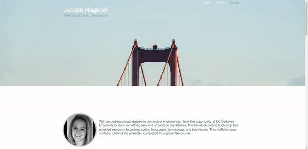

# Responsive Portfolio

## Site Video


## Technologies Used 
- HTML - Used to create elements on the DOM
- CSS - styles html elements on page 
- Git - version control system to track changes to source code
- Github - hosts repository that can be deployed to GitHub pages

## Summary
This is my portfolio created using media queries to obtain a responsive layout.

## Code Snippet
The following code shows the media query used to center the navigation bar and header across the  width of the viewport.
```css
@media only screen and (max-width: 640px) {
    h2 {
        width: 100%;
        text-align: center;
    }
    ul {
        width: 100%;
        text-align: center;
    }
    .navbar-fixed-top {
        justify-content: center;
    }
  }
```

## Author Links
https://github.com/hagoodj
https://www.linkedin.com/in/jordan-hagood-7b306410b/